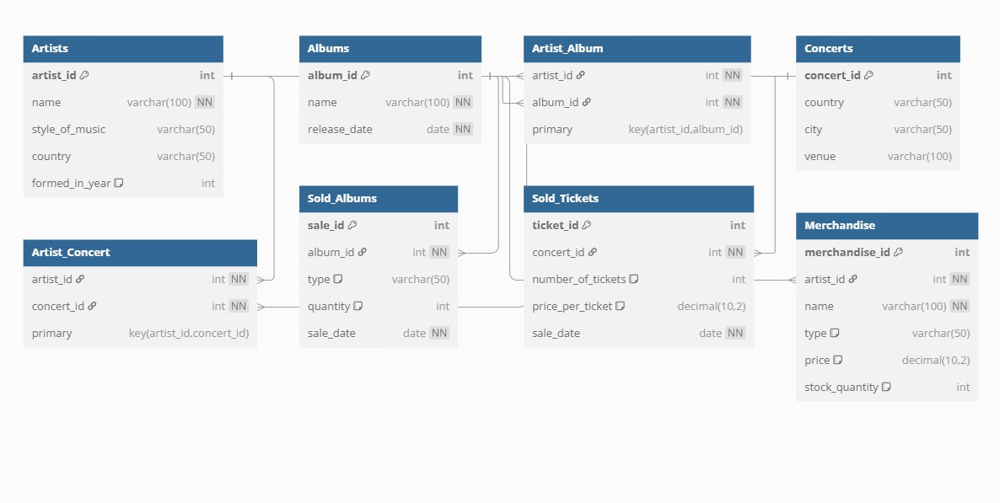

# Music Label Management System (Oracle APEX)

## Access to the project:
URL: https://apex.oracle.com/pls/apex/r/database_martin/music-label/home?session=113408105155257 

workspace: database_martin                                                       
contributor: beta             
password: 12345678                                          
reader: alfa             
password: 12345678

## Overview

This project is a web application for managing a music label, developed using Oracle APEX.
It supports the full operational workflow of a music company, including artists, albums, concerts, merchandise, sales, reviews, and reporting.

The application is based on an extended database originally developed for the course INFM111 – Programming with PL/SQL, significantly expanded with new tables, relationships, and UI functionality.

## Key Features

- Artist, album, and concert management

- Ticket and album sales tracking

- Merchandise sales

- User reviews and ratings

- Search across multiple entities

- Analytical reports and rankings

- Role-based access control

## Database Design
 .
### Relational Model

The database consists of six core tables and two relationship tables supporting many-to-many associations.

### Core Tables

- Artists – name, music style, country, year of formation

- Albums – album name, release date

- Concerts – country, city, venue

- Sold_Albums – album sales by format and quantity

- Sold_Tickets – ticket sales per concert

- Merchandise – products sold by artists

### Relationship Tables

- Artist_Concert – artists performing at concerts (many-to-many)

- Artist_Album – albums created by multiple artists (many-to-many)

### Database Properties

Fully normalized (3rd Normal Form)

All non-key attributes depend only on primary keys

Includes 7–10 demo records per table

## Application Pages & Functionality
## Home Page
 .
## Artists
 .
## Concerts
 .
## Albums
 .
## Merchandise
 .
## Sales
 .
## Profit Report
 .
## Rankings
 .
## Search
 .
## Reviews
 .
## Submission (artist applications)
 .
## About Us
 . 
## Contact
 .
## UI & Design

- Custom APEX theme (non-standard)

- Navigation menu repositioned for better UX

- Gray-scale color palette

- Custom CSS styling

- Integrated illustrations and branding elements

## Reviews & Submissions

- Users can review and rate albums and concerts

- Artists can submit applications via a dedicated submission page

- Submissions are processed within the application workflow

## Reporting & Analytics

- 12 table views (6 dynamic reports)

- 11 charts and graphs

- Detailed insights into sales, profits, and rankings

- Security & Access Control

## User roles:

### Administrator

- Full access (CRUD operations, reports, security management)
.
### Contributor

- Data entry and submission privileges
.
### Reader

- Read-only access to public data

- Role-based security is enforced throughout the application.

## Technologies Used

- Oracle APEX

- Oracle Database

- PL/SQL

- SQL

- CSS (custom UI enhancements)

## Conclusion

This project delivers a complete music label management system with a strong emphasis on database design, user experience, reporting, and security.
Its modular structure, extended relational model, and role-based access make it suitable for real-world expansion and further development.
